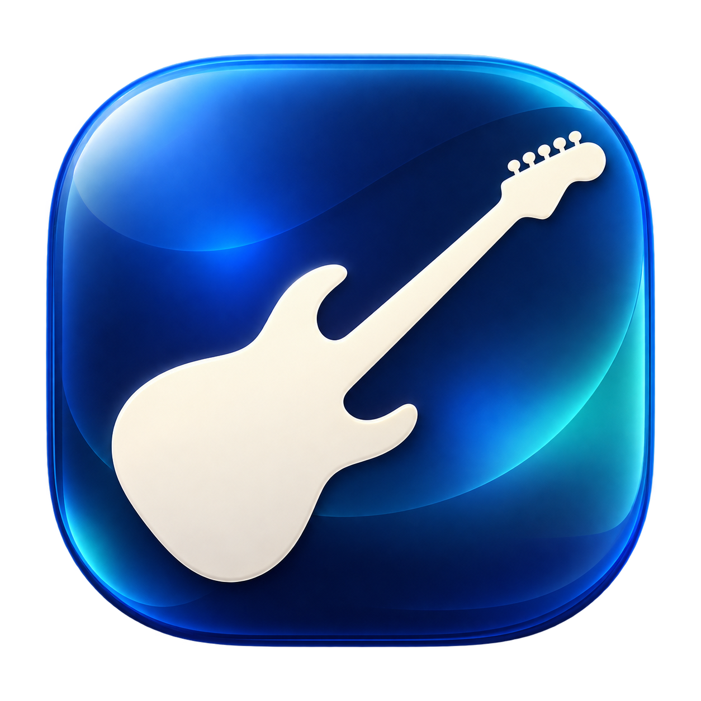
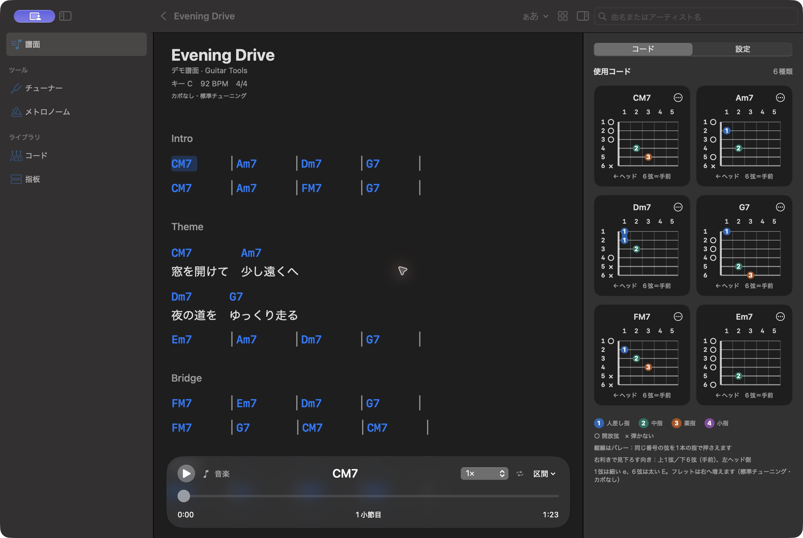

# Guitar Tools

**好きな曲を開いて、そのまま弾く。**

中級者から熟練者のギター弾きに向けた、静かなmacOSの譜面ビューアです。
譜面、曲で使うコードの押さえ方、再生操作を一つの画面にまとめました。
課題の提案や演奏の採点を始めず、必要な道具だけを手元に置きます。

[ダウンロード](https://github.com/mirinnano/guitar/releases/latest) · [Macの導入手順](docs/install-macos.md) · [変更履歴](docs/releases/v0.3.1.md) · [不具合の報告](https://github.com/mirinnano/guitar/issues/new/choose)

> **Mac版はDeveloper ID未署名、Apple未公証です（ad-hoc署名）。**
> 初回起動時にmacOSがブロックする場合があります。
> 導入前に[配布状態と安全上の注意](docs/install-macos.md)を確認してください。
> 配布DMGはApple Silicon向け、macOS 14以降です。Intel用の配布ビルドはありません。



*実際のmacOSアプリ画面。紹介用に作成したオリジナルのデモ譜面を使用しています。*

## 譜面を見ながら弾く

- ChordWikiとU-FRETから曲を探し、ネイティブの譜面で表示。
- 歌詞とコードの対応を保って折り返し。文字サイズをその場で変更。
- 右側の「コード」タブに、曲内の使用コードと押さえ方を常時表示。別フォームも選択可能。
- 自動スクロール、速度変更、区間リピート、現在コードと小節位置の表示。
- ChordWikiの楽曲情報にYouTubeリンクがあれば動画パネルを表示。オフセットや同期アンカーでタイミングを調整。
- 曲中の明示されたテンポ変更に対応。行の小節数やBPMは必要なときに自分で調整。
- 最近開いた譜面のリンクを保存。起動時は検索と履歴だけを表示。

サイドバーは「譜面」「チューナー」「メトロノーム」「コード」「指板」の5項目です。
「コード進行」「演奏判定」「コード判定」のタブは表示しません。
Liquid Glassは操作部分に使い、譜面の背景は不透明にして視認性を優先しています。
macOS 26以降と対応SDKでビルドされたアプリではネイティブのガラス表示、それ以外は標準マテリアルを使用します。

## 必要な道具

| 道具 | できること |
| --- | --- |
| チューナー | 入力デバイスとチャンネルの選択、弦ロック、基準音、各種チューニング、A4調整 |
| メトロノーム | 30–300 BPM、拍子、細分化、アクセント、Tap Tempo、カウントイン |
| コード | 12ルート×37種類、押さえ方の選択、構成音、弦ごとの音名と周波数 |
| 指板 | 音名、度数、スケール、コード、チューニングと左利き表示 |

チューナーだけが音声入力を使用します。
UR12ではINPUT 2（HI-Z）にギターを接続し、チューナーの「UR12のギター入出力を設定」を使えます。
選択した機器が未接続でも内蔵マイクや別チャンネルへ自動で切り替えません。
入力のモニターはオーディオインターフェースや普段のDAWで行ってください。
録音編集、アンプシム、ミキサーは搭載していません。

## 譜面と外部サービスの制限

譜面のタイミングは小節線や行構造からの推定です。
音源からの自動テンポ検出や、すべての曲で正確な自動同期は行いません。
動画の前奏、テンポ揺れ、譜面との差は、オフセットと同期アンカーで補正してください。
複雑なコードで図を生成できない場合も、元のコード名を保持します。

検索と譜面取得にはインターネット接続が必要です。
外部サイトの仕様変更やアクセス制限、YouTube側の埋め込み制限によって利用できない場合があります。
譜面は選択した曲だけを必要時に取得し、一括収集やサイト全体のミラーは行いません。
元サイトへのリンクを残します。
外部の歌詞、譜面、動画の権利は各権利者に帰属し、本リポジトリのMITライセンスには含まれません。

## Android版

メトロノーム、チューナー、コード、指板、ChordWiki、コード進行練習を搭載しています。
Android 8.0以降に対応し、[同じリリースページ](https://github.com/mirinnano/guitar/releases/latest)からAPKを配布します。
Mac版と機能や画面は共通ではありません。
[Androidの詳細とビルド方法](docs/android.md)

## 開発

Mac版はSwiftUIとCoreAudio、Android版はKotlinとJetpack Composeで実装しています。

```bash
# macOS: Xcodeの開発ツールを選択した環境で
swift test --package-path macOS
swift build --package-path macOS
macOS/scripts/package-app.sh

# Android: JDK 17とGradle 9.3.1、Android SDKを用意
gradle :app:testDebugUnitTest :app:assembleDebug
```

[開発への参加](CONTRIBUTING.md) / [製品方針](docs/macos-roadmap.md) / [リリース手順](.github/RELEASING.md)

アプリのソースコードは[MITライセンス](LICENSE)です。
本アプリはApple、ChordWiki、U-FRET、YouTubeの公式アプリではありません。
